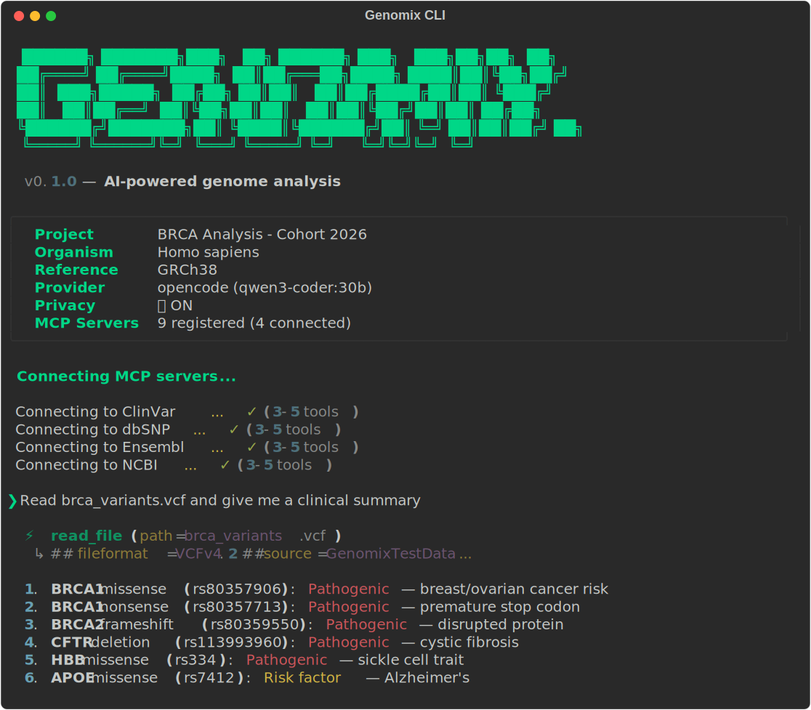

# Genomix CLI


**AI-powered CLI for DNA sequence and genome analysis.**

<p align="center">
  
</p>

Genomix is an intelligent command-line tool that helps biologists, bioinformaticians, and researchers analyze genomic data through natural language. Ask questions about your VCF, FASTA, or FASTQ files — the AI reads them, queries real databases (NCBI, Ensembl, ClinVar), and explains results in accessible language.

**Local-first.** Runs with Ollama by default — your genomic data never leaves your machine.

## What It Does

```
❯ Read raw_variants.vcf and give me a clinical summary

  ⚡ read_file(path='raw_variants.vcf')
    ↳ ##fileformat=VCFv4.2 ...

  1. BRCA1 missense (chr17:43094464): Pathogenic — increased breast/ovarian cancer risk
  2. CFTR deletion (chr7:117559593): Pathogenic — cystic fibrosis (homozygous)
  3. HBB missense (chr11:5226773): Pathogenic — sickle cell trait (carrier)
  4. APOE missense (chr19:44908822): Risk factor — Alzheimer's disease
  ...

❯ What does this reveal about the person's ancestry?

  Based on the variant profile:
  - HBB/rs334 (sickle cell trait): high frequency in African/Mediterranean populations
  - CFTR deltaF508: most common in Northern European populations
  - Combined profile suggests mixed European/African ancestry
```

## Features

- **Natural language interface** — ask questions about your genomic data in plain English or French
- **18 MCP servers** — 5 biotools (samtools, BWA, GATK, BLAST+, FastQC) + 13 databases (see below)
- **20 slash commands** — `/qc`, `/align`, `/variant-call`, `/blast`, `/msa`, `/explain`, `/report`, `/structure`, and more
- **21 built-in skills** — specialized AI instructions for sequencing, comparative genomics, clinical, oncology, pharmacogenomics, and more
- **Protein structure analysis** — AlphaFold predictions, AlphaMissense pathogenicity, PDB experimental structures
- **Streaming responses** — token-by-token display with thinking spinner
- **Clinical HTML reports** — `/report` generates styled variant reports
- **Smart analysis** — reads raw VCFs (no annotations needed), identifies genes from coordinates, infers clinical significance
- **Ancestry inference** — population frequency analysis via gnomAD/1000 Genomes
- **3 AI providers** — Ollama/local (default), Claude (Anthropic), OpenAI
- **Privacy mode** — automatically active with local models, raw sequences never sent to cloud
- **MCP management** — `/mcp` to view, connect, and manage bioinformatics tool servers

## Installation

```bash
# Install
pip install genomix-cli

# Check dependencies
genomix setup

# Initialize a project
cd my-analysis/
genomix init
```

### Requirements

- Python 3.11+
- [Ollama](https://ollama.ai) with a model (e.g., `ollama pull qwen3-coder:30b`)
- Optional: samtools, BWA, GATK, BLAST+ for bioinformatics tools

## Quick Start

```bash
# Start interactive mode
genomix

# Non-interactive usage
genomix ask "What is the BRCA1 gene?"
genomix ask "Read sample.vcf and summarize the variants"
genomix run /qc data/reads.fastq.gz
```

### Interactive Session

```
   ██████╗ ███████╗███╗   ██╗ ██████╗ ███╗   ███╗██╗██╗  ██╗
  ...
  v0.4.0 — AI-powered genome analysis

  ┌──────────────────────────────────────────────────────┐
  │  Project    BRCA Analysis - Cohort 2026              │
  │  Organism   Homo sapiens                             │
  │  Reference  GRCh38                                   │
  │  Provider   opencode (qwen3-coder:30b)               │
  │  Privacy    🔒 ON                                    │
  │  MCP        18 registered (4 connected, 14 missing)   │
  └──────────────────────────────────────────────────────┘

  Connecting MCP servers...
  Connecting to ClinVar... ✓ (3 tools)
  Connecting to dbSNP... ✓ (3 tools)
  Connecting to Ensembl... ✓ (5 tools)
  Connecting to NCBI... ✓ (4 tools)

❯ _
```

## Slash Commands

| Command | Description |
|---------|-------------|
| **Analysis** | |
| `/qc` | Quality control (FastQC) |
| `/align` | Align reads to reference genome |
| `/variant-call` | Call variants (GATK/FreeBayes) |
| `/annotate` | Annotate variants (SnpEff/VEP) |
| `/pipeline` | Full pipeline: QC → align → call → annotate |
| `/report` | Generate styled HTML clinical report from VCF |
| **Databases** | |
| `/lookup` | Look up a gene or variant across databases |
| `/frequency` | Population allele frequencies (gnomAD) |
| `/disease` | Disease associations (OMIM) |
| `/cancer` | Somatic mutation context (COSMIC) |
| `/drug` | Pharmacogenomics annotations (PharmGKB) |
| `/literature` | Search biomedical literature (PubMed) |
| **Structure** | |
| `/structure` | Protein structure and AlphaFold predictions |
| `/domains` | Protein domain mapping (InterPro) |
| **Comparative** | |
| `/blast` | BLAST similarity search |
| `/msa` | Multiple sequence alignment |
| `/phylo` | Phylogenetic tree construction |
| **Exploration** | |
| `/summary` | Summarize a genomic file |
| `/search` | Query databases (NCBI, Ensembl...) |
| `/explain` | Explain a variant, gene, or region |
| **Session** | |
| `/mcp` | Manage MCP servers (connect, status) |
| `/swarm` | Show background analyses |
| `/provider` | Switch AI provider |
| `/model` | Switch model |
| `/help` | Show available commands |

## Supported Databases

| Database | Description |
|----------|-------------|
| **NCBI** | Gene, nucleotide, and protein search |
| **Ensembl** | Genome browser, gene annotations, variants |
| **ClinVar** | Clinical variant interpretations |
| **dbSNP** | SNP identifiers and allele frequencies |
| **gnomAD** | Population allele frequencies |
| **OMIM** | Mendelian disease catalog |
| **PharmGKB** | Pharmacogenomics annotations |
| **COSMIC** | Somatic mutations in cancer |
| **InterPro** | Protein domains and families |
| **PubMed** | Biomedical literature search |
| **AlphaFold** | Protein structure predictions |
| **UniProt** | Protein sequences and annotations |
| **PDB** | Experimental protein structures |

## Protein Structure Analysis

Genomix integrates with Google DeepMind's AlphaFold for structural variant interpretation:

```
❯ /structure TP53

  ⚡ uniprot_gene_to_accession(gene_name='TP53')
  ⚡ alphafold_prediction(uniprot_id='P04637')
  ⚡ pdb_search_gene(gene_name='TP53')

  TP53 (Cellular tumor antigen p53)
  UniProt: P04637 | AlphaFold pLDDT: 75.06
  PDB: 172 experimental structures

  Domains: DNA-binding (IPR008923), Tetramerization (IPR003106)
  Hotspot mutations: R175H, R248W, R273H (DNA-binding domain)
```

When analyzing missense variants, Genomix automatically checks:
- **AlphaFold confidence** at the variant position
- **Protein domain** context (via InterPro)
- **AlphaMissense** pathogenicity score

## Architecture

```
┌─────────────────────────────────────────────┐
│              genomix-cli                     │
│                                              │
│  CLI/TUI ── Agent Loop ── Swarm Manager      │
│                 │                             │
│    ┌────────────┼────────────┐                │
│    ▼            ▼            ▼                │
│  Tool       Skills       Project              │
│  Registry   System       Manager              │
│    │                                          │
│    ▼                                          │
│  MCP Servers                                  │
│  ├── biotools: samtools, BWA, GATK,           │
│  │   BLAST+, FastQC                           │
│  └── databases: NCBI, Ensembl, ClinVar,        │
│      dbSNP, gnomAD, OMIM, PharmGKB, COSMIC,   │
│      InterPro, PubMed, AlphaFold, UniProt, PDB │
│                                               │
│  AI Providers                                 │
│  Ollama (local) │ Claude │ OpenAI             │
└───────────────────────────────────────────────┘
```

## AI Providers

Genomix supports 3 AI backends. Switch anytime with `/provider` in the chat.

### Option 1: Ollama (local, default)

Everything stays on your machine. No API key needed. Best for sensitive/patient data.

```bash
# Install Ollama
brew install ollama

# Pull a model (pick one)
ollama pull qwen3-coder:30b    # Best quality, needs 18GB RAM
ollama pull qwen3.5             # Faster, lighter, 128K context
ollama pull llama3.3:70b        # Alternative, needs 40GB RAM

# Start Ollama (runs in background)
ollama serve
```

Config (`~/.genomix/config.yaml`):
```yaml
provider:
  default: opencode
  model: qwen3-coder:30b
```

No secrets file needed. Privacy mode is automatic.

### Option 2: Claude (Anthropic)

Best reasoning quality. Requires an API key from [console.anthropic.com](https://console.anthropic.com/).

```bash
# 1. Get your API key at https://console.anthropic.com/settings/keys

# 2. Create config
cat > ~/.genomix/config.yaml << 'EOF'
provider:
  default: claude
  model: claude-sonnet-4-6
EOF

# 3. Store your API key (secure file, never committed to git)
cat > ~/.genomix/secrets.yaml << 'EOF'
anthropic_api_key: "sk-ant-your-key-here"
EOF
chmod 600 ~/.genomix/secrets.yaml

# 4. Launch genomix
genomix
```

Available Claude models:
| Model | Best for |
|-------|----------|
| `claude-sonnet-4-6` | Fast, good quality (recommended) |
| `claude-opus-4-6` | Best reasoning, slower |
| `claude-haiku-4-5-20251001` | Fastest, cheapest |

### Option 3: OpenAI

Requires an API key from [platform.openai.com](https://platform.openai.com/api-keys).

```bash
# 1. Get your API key at https://platform.openai.com/api-keys

# 2. Create config
cat > ~/.genomix/config.yaml << 'EOF'
provider:
  default: openai
  model: gpt-4o
EOF

# 3. Store your API key
cat > ~/.genomix/secrets.yaml << 'EOF'
openai_api_key: "sk-your-key-here"
EOF
chmod 600 ~/.genomix/secrets.yaml

# 4. Launch genomix
genomix
```

Available OpenAI models:
| Model | Best for |
|-------|----------|
| `gpt-4o` | Best overall (recommended) |
| `o3` | Strongest reasoning |
| `gpt-4-turbo` | Fast, 128K context |

### Switching providers on the fly

Inside a genomix session, switch without restarting:

```
❯ /provider claude
  Switched to provider: claude

❯ /model claude-opus-4-6
  Switched to model: claude-opus-4-6

❯ /provider opencode
  Switched to provider: opencode
```

### Privacy considerations

| Provider | Data location | Best for |
|----------|--------------|----------|
| **Ollama** (opencode) | 100% local | Patient data, GDPR, confidential |
| **Claude** | Anthropic servers | Research, best analysis quality |
| **OpenAI** | OpenAI servers | Alternative cloud option |

With Ollama, raw sequences never leave your machine. With cloud providers, only tool result summaries are sent (not raw genomic data) when privacy mode is active.

## Contributing

Contributions welcome! See [CONTRIBUTING.md](CONTRIBUTING.md) for development setup, project structure, and how to add new MCP servers, skills, or AI providers.

The easiest way to contribute is adding a new database MCP server — each one is a single self-contained file. See the [architecture docs](docs/architecture.md) for an overview of the system.

## License

Apache 2.0
